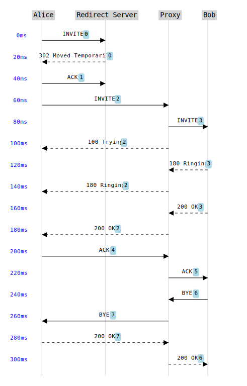

# seqdiag
NPM package to draw network sequence diagram SVGs

## Usage
See [Sample.tsx](./sample/src/Sample.tsx) for example usage.

## Sample
To run the sample, do the following:
1. `cd sample`
1. `npm i`
1. `npm start`

You should see the following diagram generated by the sample:

